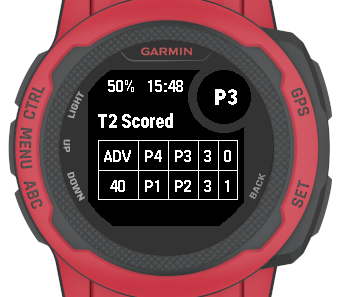

# PadelScoreBoard for Garmin Instinct 2s

## Overview
PadelScoreBoard is a Connect IQ watch app for the Garmin Instinct 2s that helps you keep score for padel matches. It tracks points, games, sets, player positions, and serve rotation according to official padel rules. The app provides a simple table UI, sound cues, and menu actions for resetting, undoing, and exiting the app.

## Features
- Score tracking for two teams (bottom: P1 & P2, top: P3 & P4)
- Tennis-style scoring (0, 15, 30, 40, ADV, deuce)
- Game and set counters
- Player position and serve rotation management
- Undo last action
- Reset all scores and positions
- Exit to watch face
- Sound cues for scoring, serve changes, and undo
- Current time display (top left)

## How to Build and Test

### Prerequisites
- [Garmin Connect IQ SDK](https://developer.garmin.com/connect-iq/sdk/) installed
- [VS Code](https://code.visualstudio.com/) with the [Connect IQ extension](https://marketplace.visualstudio.com/items?itemName=Garmin.connectiq)

### Building the App
1. Open the project folder (`PadelScoreBoard`) in VS Code.
2. Press `Ctrl+Shift+P` (or `Cmd+Shift+P` on Mac) to open the Command Palette.
3. Type `Monkey C: Build for Device` and select it to build the app.
   - The compiled `.prg` file will appear in the `bin/` directory.
4. Then copy the compiled `.prg` into your watches `GARMIN/APPS` folder.

### Testing in the Simulator
1. Run with `F5` while having an `mc` file in focus, this should start the simulator
2. Interact with the app using the simulator buttons:
   - **SET**(top right): Add point for top team
   - **BACK**(bottom right): Add point for bottom team
   - **Menu**(center left): Open menu (long press UP)
   - **Menu options**: Undo, Reset Score, Exit
3. For a new build, the simulator does not have to be restarted, but it's advised to kill the app `Ctrl+A` before starting with step 1 again

### Menu Actions
- **Undo**: Reverts the last scoring action
- **Reset Score**: Resets all scores and positions
- **Exit**: Closes the app and returns to the watch face

## Notes
- All scoring logic and serve rotation follow padel rules, except for the player rotation
- Sound cues use built-in and custom tone profiles (if supported)
- The app is designed for Instinct 2s but may work on other Connect IQ devices

## Troubleshooting
- If you encounter build errors, check for missing SDK or extension updates
- Use the VS Code Problems panel for error details
- For device-specific issues, consult the Garmin Connect IQ documentation
- otherwise, ¯\\_(ツ)_/¯

## License
MIT License
